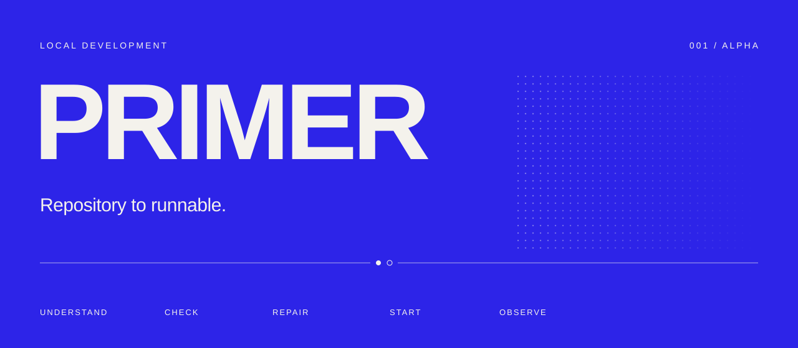
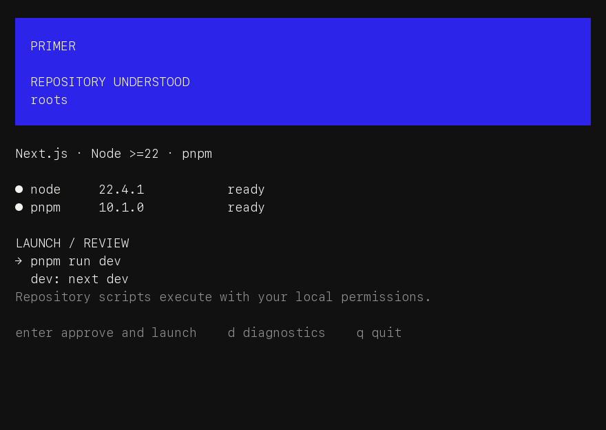

<p align="center">
  
</p>

<p align="center">
  <a href="https://github.com/desenyon/primer/actions/workflows/ci.yml"></a>
  <a href="https://github.com/desenyon/primer/releases"></a>
  <a href="LICENSE"></a>
</p>

<p align="center"><strong>Understand a repository. Review its dev command. Bring it up.</strong></p>

Primer inspects a local repository, checks its requirements, previews the command
that starts it, and stays open as a process and log dashboard. Every conclusion
has evidence. The core uses deterministic analysis and works without an LLM.

**This alpha supports Node and Next.js.** Python, Compose, databases and repair
actions are coming next. [See the exact implementation boundary](docs/STATUS.md).

## Install

macOS or Linux · Apple Silicon / ARM64 or Intel / AMD64 · no Go toolchain needed.

```sh
curl -fsSL https://raw.githubusercontent.com/desenyon/primer/v0.1.0-alpha.1/install.sh | sh
```

Then, inside your Node repository:

```sh
primer
```

No arguments. No manifest. The scan starts immediately.

The installer verifies the release's SHA256 checksum and embedded version, then
installs `primer` into `~/.local/bin`. It uses no sudo and does not edit your shell
configuration. If that directory is absent from PATH, add it:

```sh
export PATH="$HOME/.local/bin:$PATH"
```

<details>
<summary>Download first, choose a directory, or install from source</summary>

Download and inspect the installer before running it:

```sh
curl -fsSLo install-primer.sh https://raw.githubusercontent.com/desenyon/primer/v0.1.0-alpha.1/install.sh
sh install-primer.sh
```

Or use wget:

```sh
wget -qO install-primer.sh https://raw.githubusercontent.com/desenyon/primer/v0.1.0-alpha.1/install.sh
sh install-primer.sh
```

Choose an installation directory:

```sh
PRIMER_INSTALL_DIR="$HOME/bin" sh install-primer.sh
```

Pin another published release with `PRIMER_VERSION=v…`, or download its archive
and `checksums.txt` directly from [Releases](https://github.com/desenyon/primer/releases).

Build from source with Go 1.26.4 or later:

```sh
git clone https://github.com/desenyon/primer.git
cd primer
go build -o bin/primer ./cmd/primer
mkdir -p "$HOME/.local/bin"
install -m 755 bin/primer "$HOME/.local/bin/primer"
```

</details>

## From scan to session

**Inspect.** Read package manifests, lockfile names, Node pins and environment
templates. Check tools, dependencies and expected Next.js ports. No repository
script runs during detection.

**Review.** See the actual package-manager command and dev/predev/postdev scripts.
Long previews wrap and scroll; approval waits until their end has been shown.
Conflicting declarations or missing prerequisites block launch.

**Run.** Press Enter. Primer rechecks the reviewed manifest and starts the dev
process group. Follow logs, inspect diagnostics, restart, or stop. Quit closes
the session and stops the processes Primer owns.

<p align="center">
  
</p>

The everyday interface stays sparse: ultramarine fields, near-white detail,
restrained rules and deliberate negative space. Color has a fallback; status
always has a symbol and text. These images render real views using illustrative
model data. [Inspect the wider dashboard](docs/visual-review/dashboard-120x35.png).

## Commands

| Command | Behavior |
| --- | --- |
| `primer` | Scan the current repository, review and enter the dashboard |
| `primer doctor` | Run available checks without launching |
| `primer doctor --json` | Report the model and diagnostics as JSON |
| `primer env` | Show environment-template names and configured/missing/empty states |
| `primer start --yes --no-interactive` | Explicitly approve the dev command and stream logs |
| `primer --path /path/to/project` | Inspect another directory |
| `primer --version` | Print the installed version |
| `primer --help` | Show CLI usage |

Without a TTY, Primer prints useful inspection results and does not implicitly
execute repository code. `--json` is inspection-only. `NO_COLOR`, `TERM=dumb`,
`--no-color` and `--no-interactive` are respected. Doctor/env return 1 for issues,
0 when their available checks pass, and 2 for invalid CLI input.

### Keyboard

| Key | Action |
| --- | --- |
| `enter` | Approve a fully reviewed launch |
| `l` / `d` | Logs / diagnostics and evidence |
| `r` / `s` | Restart / stop dev |
| `:` or `ctrl+k` | Command palette |
| `/` | Filter logs |
| `space` | Pause / follow logs |
| `↑ ↓` or `j k` | Navigate or scroll |
| `esc` / `?` / `q` | Back / help / quit and stop |

## What this alpha verifies

| Area | Current behavior |
| --- | --- |
| Detection | Node, Next.js, npm/pnpm/yarn/bun, runtime pins, root scripts, env templates, common Next.js ports |
| Diagnostics | Runtime/manager mismatch or absence, conflicting lockfiles, missing dependencies, template variables, unavailable ports |
| Runtime | One dev launch group, stdout/stderr, restart, graceful stop with escalation, descendant cleanup |
| Interface | Scan, command review, dashboard, diagnostics, logs, help and session palette |
| Distribution | macOS/Linux ARM64/AMD64 binaries, shell installer, SHA256 checksums |

The Node dependency check establishes that `node_modules` is populated; it does
not prove lockfile synchronization or package integrity. “Running” refers to the
launcher process. The displayed URL is expected, rather than a health assertion.
Template entries do not establish required/optional semantics and are advisory.

Private environment values are hidden in reports and known values are redacted
in previews and log views. Raw logs remain in bounded session memory; terminal
controls are stripped from presentation. Unknown credentials printed by an
application cannot be reliably identified. Nothing is uploaded or persisted.

## Develop

```sh
go test -race ./...
go vet ./...
sh scripts/build-release.sh
```

The release builder produces four archives, the installer and checksums in
`dist/`. GitHub CI runs native macOS/Linux tests; tagged releases are built only
after those checks pass. The installer tests verify successful installation and
rejection of corrupt, ambiguous or mismatched downloads.

Try the real Next.js fixture with pnpm 11.4.0:

```sh
pnpm install --dir fixtures/next-basic --frozen-lockfile --ignore-scripts
cd fixtures/next-basic
primer
```

The isolated smoke test served HTTP 200, streamed ready output, and confirmed
that shutdown removed the process group and closed its port.
[Recorded result](docs/next-smoke-proof.json). The published binary also passed
the complete bare-`primer` interactive path after installation from GitHub.
[Installed release proof](docs/distribution-proof.json).

## Next

Reviewed installation repairs → Compose service evidence → ordered PostgreSQL
and Redis startup → Prisma generation and development migrations → multi-service
supervision. Keep each step useful and verifiable.

[Product and design constraints](AGENTS.md) · [Implementation checkpoint](docs/STATUS.md)
· [MIT license](LICENSE)
